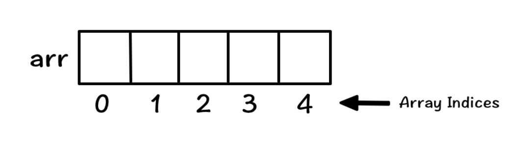

# ARRAYS 

** Declaration Of the array 

Syntax for array declaration 

            dataType[] arrayName; (*** Code1)

Instantiation of this array:

            arrayName = new dataType[size]; (***Code1)

Ways to make the array (***Code1)

