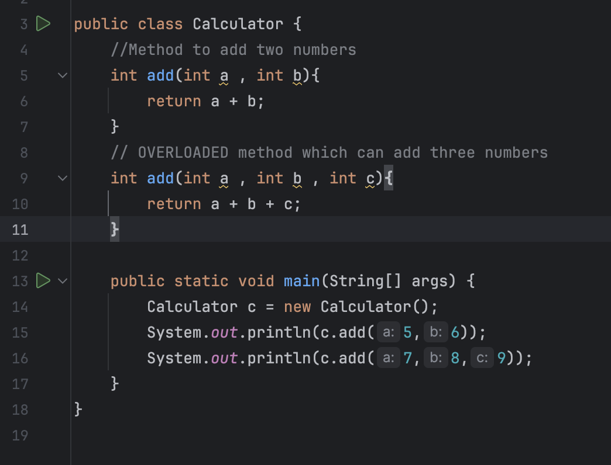

# OOPS in JAVA 

* What is OOPs? 
Ans - OOPs is a programming paradigm that organises code into object and classes . This makes the code more organised , reusable and easier to maintain 

* What is Class ?
Ans - It is the blueprint or the template that defines the structure of the object 

* What is the object ?
Ans - It is a real world entity that has properties(attributes) and behaviour(method)

* 4 PRINCIPLES OF OOPS 

* Encapsulation , Inheritance , Polymorphism , Abstraction 

* Encapsulation : It is a fundamental concept in the OOPs where the internal details of an object are hidden from the outside world . IT IS THE PROCESS OF BUNDLING THE OBJECT's DATA AND METHODS TOGETHER INTO THE SINGLE UNIT (CLASS)

* The primary goal is to protect the internal state of an object from unintended modifications and provide controlled access to it.

* Constructor : A constructor is a special method that is called when an object is created . It is used to initialize the object's state 
        1) Constructor has the same name as that of the class 
        2) it does not have a return type
        3) it is automatically called when the object is created 

* MEHOD OVERLOADING : It is a feature that allows a class to have more than one method with same name but with different parameters 

WHY METHOD OVERLOADING ?

* TO increase the code readibility 
* To perform similar similar operations 

