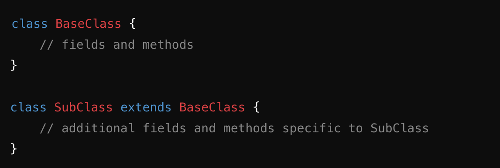
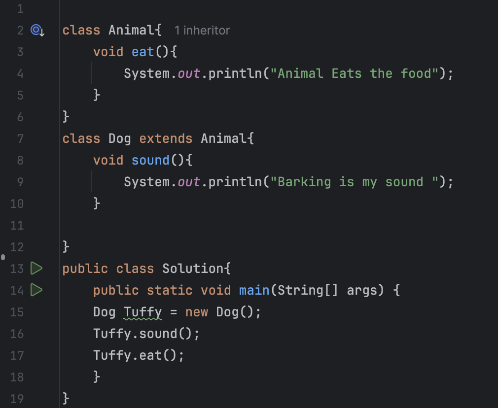

# Inheritance 

## What is Inheritance ?
* Ans - Inheritance is a mechanism in OOPs that allows one class to acquire the properties(field)
and behaviour(methods) of another class . It promotes code reusability and establish a parent child relationship between classes 

## Base class(parent class): 
* The class whose properties and methods are inherited 
## Sub class(child class): 
* The class that inheries the properties and methods of the base class 

## Why use Inheritance ? 
* Ans - 1) Code Reusability : Avoids duplication by reusing the existing code 
      2) Improved Maintainibility : Changes in base classes are reflected in all subclasses 

## How to use inheritance ?
* Ans - Inheritance in Java is implemented using "extends" keyword  

* 

## Types of Inheritance 

* 1) Single Level Inheritance 2) Multilevel Inheritance 3) Hierarchical Inheritance 

### Single level Inheritance 
* Ans ) One class Inherits from Another 
* Dog Class inherits from Animal Class 

* 

### Multi Level Inheritance 
* Next Notes 
