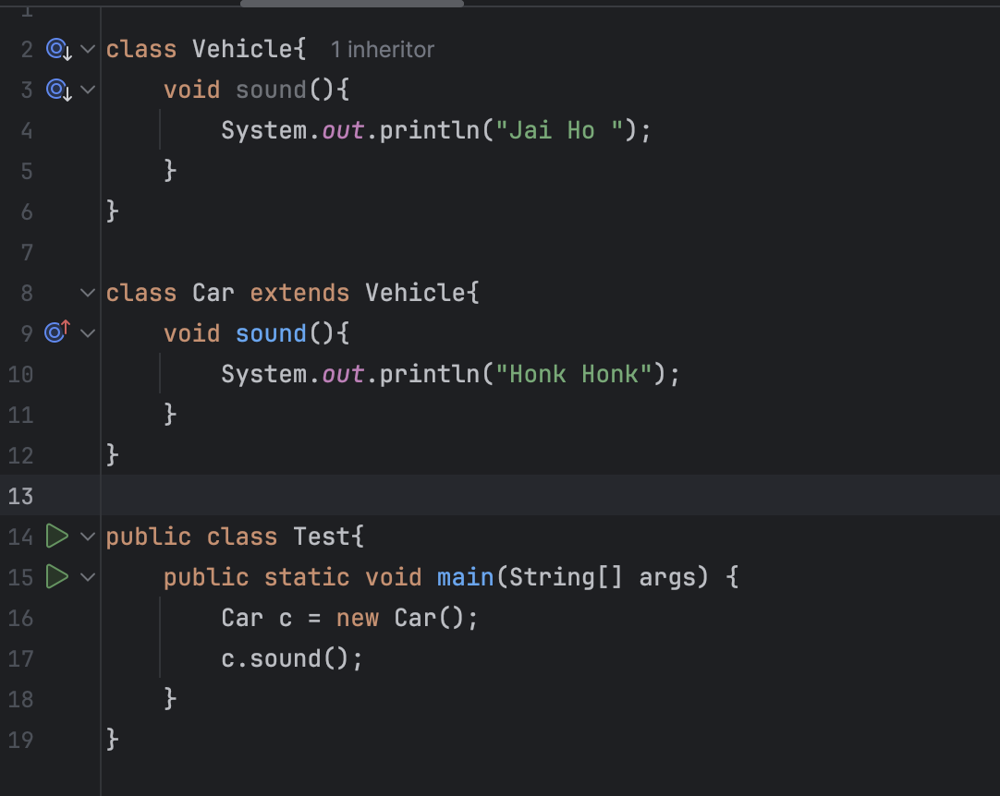

# Inheritance Continued

## Multi-Level Inheritance 

* Multilevel Inheritance there is a chain of inheritance . Here the child class of one level becomes the parent class for another level.

## Method Overriding  

* Method overriding is a concept in OOPs where a child class provides a new implementation for a method that is already defined in the parent class (the method in the child class must have same name , return type and parameters )as one in the parent class 

* In simple terms child class is overriding the behaviour of the parent class 

