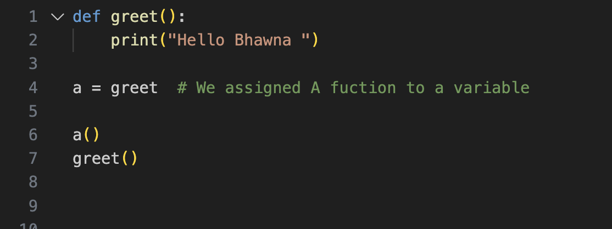
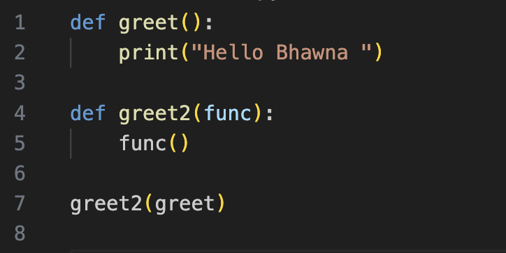
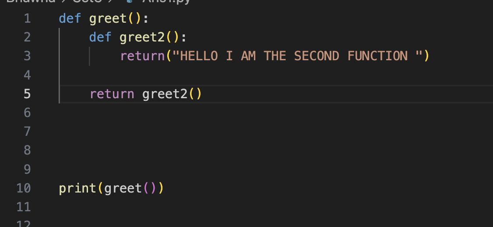
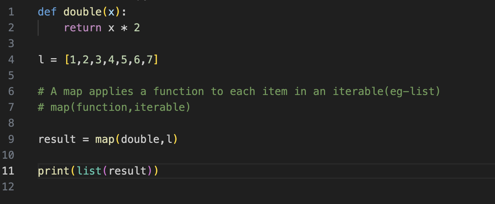

# Higher Order Function 

## Basics 

### What is Function?
* A function is a reusable piece of code that performs a specific task . Instead of writing the same code multiple times , we can write it once inside a function and call it whenever we need it 

### Why do We use functions 
* Code Reusability 
* modularity 
* It makes the code cleaner and easier to read 

### Functions are first class citizens in Pythons . Why?

* This is called so because of 3 reasons 
* 1) We can Assign Function to a variable 
 

* 2) We can pass functions as an argument to other functions 

* 3) We can return a function from other functions

## What are Higher Order Functions ? 

* A higher order function is a function that does one or both of the following 
* 1) Takes another function as an argument 
* 2) It returns a functions as a result 

* Map , filter , Reduce are 3 higher order functions in python

## map 

* Map is a builtin higher Order Function 
* it applies a function to each item in an iterable(eg - list )
        Syntax
        map(function , iterable)

